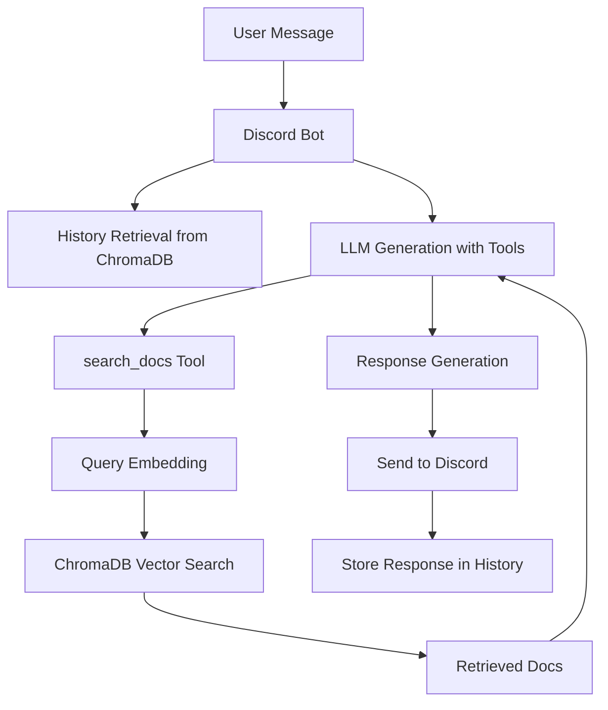

# discollama

`discollama` is a Discord bot powered by Ollama cloud models with Retrieval-Augmented Generation (RAG) for answering questions about Ollama documentation.

## Architecture



## Dependencies

- Python 3.11+
- uv (for dependency management)
- Ollama account (for cloud models)

## Setup

1. Install uv: `pip install uv`
2. Clone the repo and install dependencies: `uv sync`
3. Sign in to Ollama: `ollama signin`
4. Fetch Ollama documentation: `uv run python scripts/fetch_docs.py`
5. Process and chunk docs: `uv run python scripts/process_local_docs.py`
6. Embed and store docs: `uv run python scripts/embed_docs.py`

## Run the bot

```
DISCORD_TOKEN=xxxxx uv run python main.py
```

> [!NOTE]
> You must setup a [Discord Bot](https://discord.com/developers/applications) and set environment variable `DISCORD_TOKEN` before `main.py` can access Discord.

The bot uses Ollama cloud models by default (`gpt-oss:20b-cloud`). Ensure you have signed in with `ollama signin` to access cloud models.

## Customize `main.py`

The default model is `gpt-oss:20b-cloud`. You can change it with the `--ollama-model` argument or `OLLAMA_MODEL` environment variable.

Available cloud models include:

- `gpt-oss:20b-cloud`
- `gpt-oss:120b-cloud`
- `deepseek-v3.1:671b-cloud`
- `kimi-k2:1t-cloud`
- `qwen3-coder:480b-cloud`

See [Ollama Cloud](https://docs.ollama.com/cloud) for more details.

## Activating the Bot

Discord users can interact with the bot by mentioning it in a message. The bot will use RAG to retrieve relevant Ollama documentation and provide accurate answers about Ollama.

## Troubleshooting

### Bot Not Responding

- Ensure `DISCORD_TOKEN` is set correctly.
- Check bot permissions in Discord (message content intent required).
- Verify Ollama signin: `ollama signin`.

### Embedding/Retrieval Issues

- Run setup steps in order: fetch -> process -> embed.
- Check `data/ollama_docs.json` and `data/chroma_db` exist.
- Ensure Ollama models are pulled: `ollama pull nomic-embed-text`.

### Performance Problems

- For large docs, increase batch size in `embed_docs.py`.
- Monitor ChromaDB storage; clear old data if needed.

### Docker Issues

- Build with `docker build -t discollama .`
- Run with `docker run -e DISCORD_TOKEN=xxx discollama`
- Check logs: `docker logs <container>`
